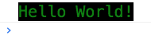
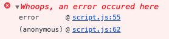

# ColorLog
A libary full with color functions and console log functions of course!

# Why ColorLog.js?
Cuz why not...

# Docs

These are the current functions in the library:

## log
```
cl.log(message, color, background-color, font-size);
```
### -Message
The ```message``` paramater expects a string. This is the string that outputs in the console.

### -Color
The ```color``` paramater expects a string. This will set the text color.

### -Background-color
The ```background-color``` paramater expects a string. This will set the background color.

### -Font-size
The ```color``` paramater expects a string. This will set the font size.

This function can be used to log things with different styles.
You can use this function as followed:
```
cl.log("Hello World!", "Green", "#000", "20px");
```
The output wil be the following:



## error

```
cl.error(string)
```
### -String
The ```String``` paramater expects a string. This is the string that outputs in the console.
This function can be used to log a custom error.
You can use this function as followed:

```
cl.error("Whoops, an error occured here");
```
The output will be the following:



## isColorName

```
cl.isColorName(color);
```
This function returns true if the color is a color based on its name. If this is not the case, it returns false.
You can use this function as followed:
```
//Returns false
cl.isColorName("greens");

//Returns true
cl.isColorName("green");
```

## isColorHex

```
cl.isColorHex(color);
```
This function returns true if the color is a color based on its hex value. if this is not the case, it returns false.

```
//Returns False
cl.isColorHex("#fffff");

//Returns True
Returns True("#ffffff");
```
